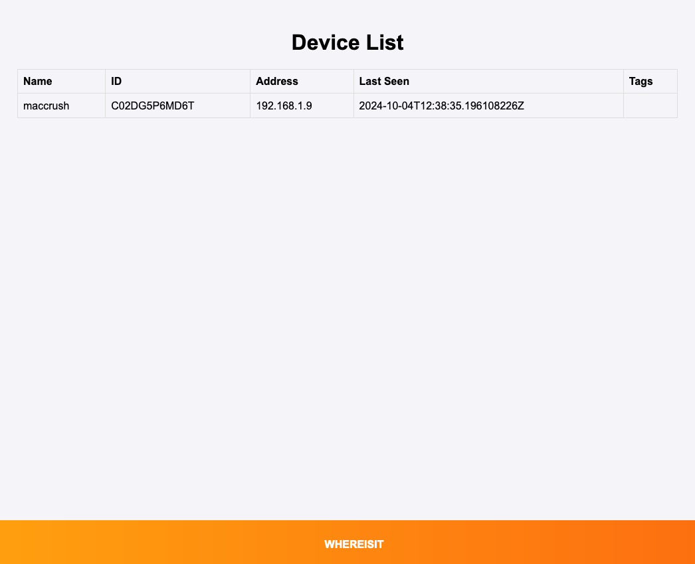

# whereisit

[](https://github.com/Boernsman/whereisit/actions/workflows/ci.yml)

Where is my device? And why is Zeroconf not working? Damn it!

This tool eases your pain. It helps you to find your devices.




## Usage

Start the server with:

```
./whereisit
```


Register a device with:

```
curl -H "Content-Type: application/json" -X POST -d '{"name":"${DEVICE_NAME}","address":"${DEVICE_IP}"}' http://${SERVER_IP}:8180/api/register
```

List the devices with:

```
http://${SERVER_IP}:8180/api/devices
```

See the build in web ui:

```
http://${SERVER_IP}:8180
```


## Build

```
go build .
```

## Test

```
go test .
```

## Security

To ensure the security and protect data integrity, 'whereistit' offers 2 authentication methods that are diabled by default.

**Basic Authentication**

Basic Authentication can be enabled to verify user identity via a username and password combination. 
Credentials for Basic Auth are stored securely in the 'whereisit.ini' file. 
We recommend using HTTPS to prevent the interception of credentials during transmission. 

**API Key Authentication**

For external client authentication, API Key Authentication can also be enabled. Each client is assigned a unique API key, which is stored in the 'whereisit.ini' file. 
The API key must be included in the request headers for all API interactions. This method ensures that access is restricted to authorized users and allows tracking of individual client activity.

Both methods rely on secure storage and management of credentials in the whereisit.ini file. 


## License

[MIT](https://tldrlegal.com/license/mit-license)
