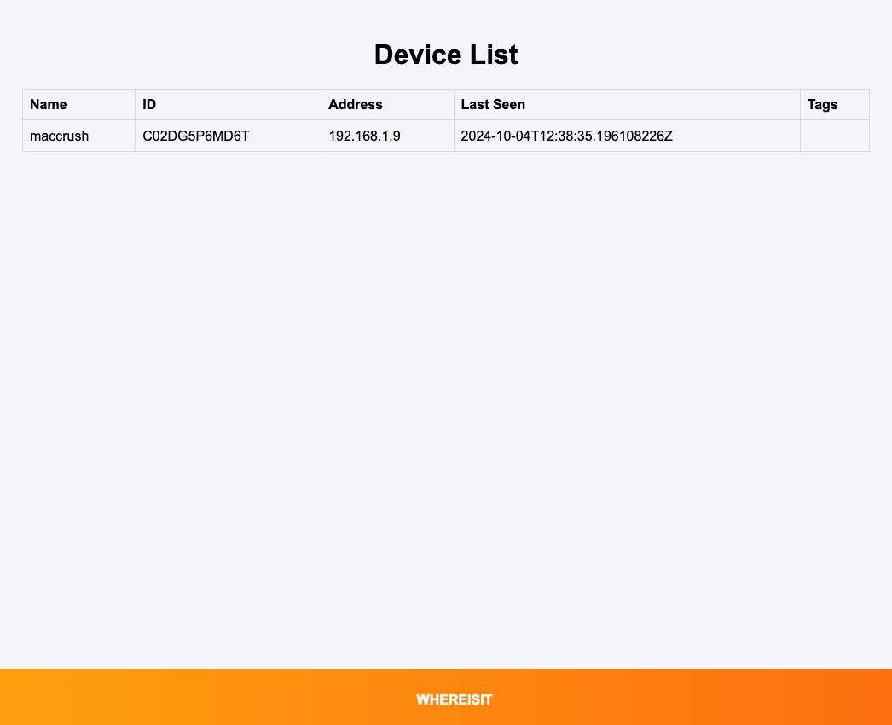

# whereisit

[](https://github.com/bitcrushtesting/whereisit/actions/workflows/ci.yml)
[](https://github.com/bitcrushtesting/whereisit/actions/workflows/docker.yml)

Where is my device? And why is mDNS not working? Damn it!

A lightweight service that helps you locate devices on your network. Devices register themselves with their IP address, and the server groups them by the external IP of the caller. So you only see devices from your current network.



## How it works

Devices on your network periodically POST their hostname and IP to `/api/register`. The server stores the registrations and groups them by the caller's external IP. When you open the web UI or query `/api/devices`, you see only the devices that registered from your network.

## Quick start

### Binary

```sh
./whereisit
```

### Docker

```sh
docker run -p 8180:8180 -p 8181:8181 ghcr.io/bitcrushtesting/whereisit:latest
```

Override the configuration with a volume mount:

```sh
docker run -p 8180:8180 -p 8181:8181 \
  -v /path/to/whereisit.ini:/etc/whereisit.ini \
  ghcr.io/bitcrushtesting/whereisit:latest
```

## API

### Register a device

```sh
curl -X POST http://${SERVER_IP}:8180/api/register \
  -H "Content-Type: application/json" \
  -d '{"name":"${DEVICE_NAME}","address":"${DEVICE_IP}"}'
```

> The API runs on port `8180` by default. The web UI runs on port `8181`.

| Field | Type | Description |
|-------|------|-------------|
| `name` | string | Human-readable device name |
| `address` | string | Device IP address |
| `id` | string | Unique identifier (e.g. serial number) — used to update existing entries |
| `tags` | object | Arbitrary key/value metadata |

### List devices (current network)

```
GET http://${SERVER_IP}:8180/api/devices
```

Returns only devices that registered from the same external IP as the caller.

### List all devices

```
GET http://${SERVER_IP}:8180/api/alldevices
```

### Web UI

```
http://${SERVER_IP}:8181
```

## Configuration

The server reads config from `/etc/whereisit.ini`, falling back to `./whereisit.ini`.

```ini
[basic_auth]
enabled  = false
username = admin
password = admin

[api]
port            = 8180
api_key_enabled = false
api_key         = your_api_key

[ui]
port    = 8181
name    = WHEREISIT
link    = https://github.com/bitcrushtesting/whereisit
logo    =
; Set api_url when API and UI run on different hosts/ports, e.g. http://yourserver:8180
api_url =
```

### `[ui]` settings

| Key | Default | Description |
|-----|---------|-------------|
| `port` | `8181` | Port the web UI listens on |
| `name` | `WHEREISIT` | Brand name shown in the UI |
| `link` | project URL | URL the brand name links to |
| `logo` | _(none)_ | Path or URL to a logo image |
| `api_url` | _(same host)_ | Override the API base URL as seen from the browser — needed when API and UI run on different ports behind a reverse proxy |

### Command-line flags

| Flag | Default | Description |
|------|---------|-------------|
| `--api-port` | `8180` | Port for the API server |
| `--ui-port` | `8181` | Port for the UI server |
| `--public` | `./public/` | Path to static web files |
| `--lifetime` | `24` | Device entry lifetime in hours |
| `--verbose` | `false` | Enable debug logging |

## Security

Both authentication methods are disabled by default and configured in `whereisit.ini`.

**Basic Authentication** — enables username/password protection for the API. Use a TLS-terminating reverse proxy to protect credentials in transit.

**API Key Authentication** — clients include an `X-API-Key` header with every request.

## Client examples

Ready-to-use registration scripts are in [`examples/`](examples/):

- [`examples/sh/`](examples/sh/) — shell scripts
- [`examples/python/`](examples/python/) — Python clients
- [`examples/systemd/`](examples/systemd/) — systemd timer for periodic registration

## Build

```sh
go build .
```

## Test

```sh
go test .
```

## License

[MIT](https://tldrlegal.com/license/mit-license)
